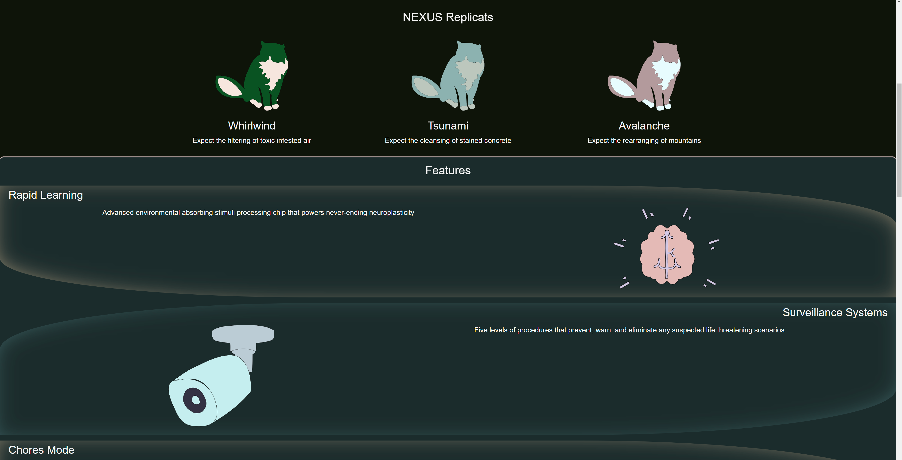
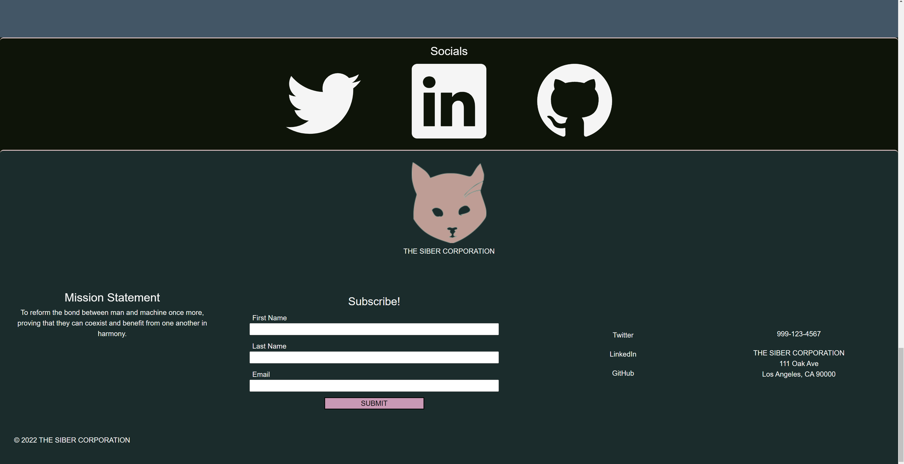
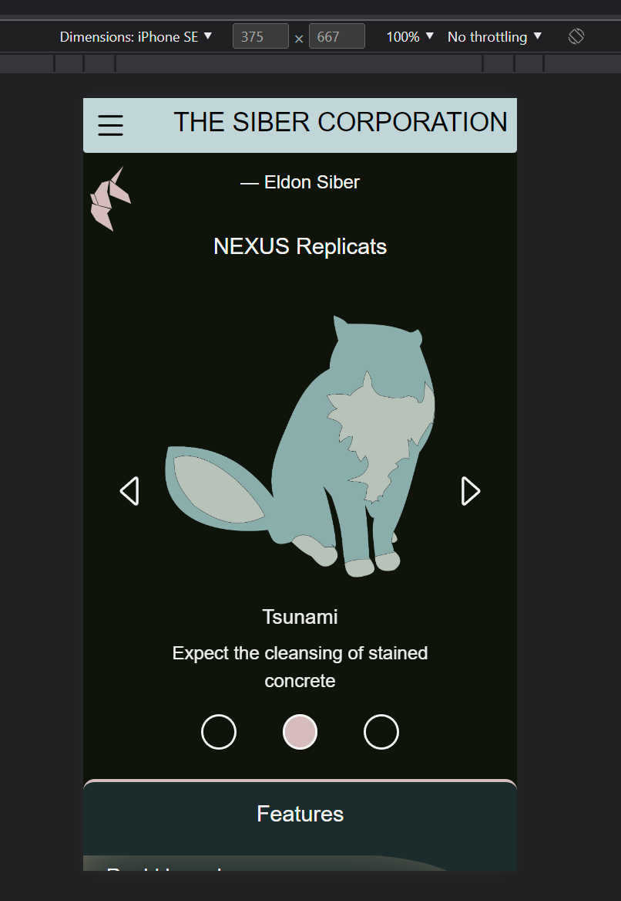
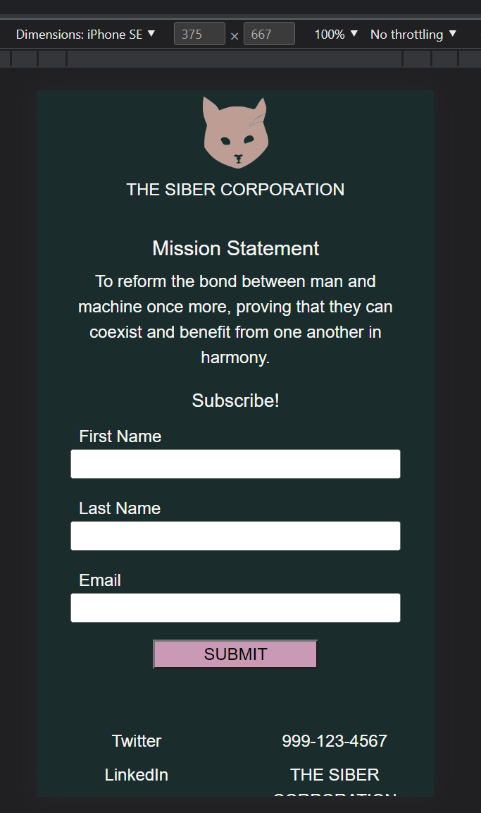

# Replicat Soft Revival

## What
Replicat Soft Revival is a website that promotes a fictional company's fictional product. Their site will introduce you to the company's vision and products and it will also give you the opportunity to follow them. 

## Why
 - To practice and focus on the designing aspects of web development (CSS, Sass, Bootstrap).
 - To "revive" my first project ever made with a ~10 month knowledge/skills difference. (<a href='https://github.com/Marcelino-G/RepliCat'>Replicat</a>)

## Sources

  ### Images taken from <a href='https://www.imdb.com/title/tt0083658/mediaindex?page=2&ref_=ttmi_mi_sm' >IMDb</a>
  - "Blade Runner city"
  - "Blade Runner (man smirking)"
  
  ### Images MADE with <a href='https://www.gimp.org/' >GIMP</a> and <a href='https://inkscape.org/' >INKSCAPE</a>
  - THE SIBER CORPORATION logo
  - NEXUS Replicat (Whirlwind model)
  - NEXUS Replicat (Tsunami model)
  - NEXUS Replicat (Avalanche model)
  - Rapid Learning (brain)
  - Surveillance Systems (camera)
  - Chores Mode (paint brush)
  
## Site
https://marcelino-g.github.io/Replicat-Soft-Revival/

## Video Demonstration
https://youtu.be/U4fYexZDCh8

## Page Description
  - Desktop View
    
    At the top, you'll see the navigation immediately accessible with the company logo to the left of it and the company name to the right. Underneath will be a picture of Los Angeles and a quote from the owner of the company. You will then be able to see ALL Replicat models all at once in a horizontal view. Scrolling down, you will see an animation play that applies to the features image when it is reached (this is dependent on the screen size of the desktop/laptop/tablet). Past the features section is a picture of a man smirking and a FAQ section that reveals answers to questions when a question is clicked. At the bottom you can find links related to the company and information on how to contact them. 
  - Mobile View
    
    Instead of the navigation being immediately accessible, it is "opened up" when the hamburger picture is clicked (the header is "stuck" to the top of the screen when scrolling). Here, the company's logo within the navigation is missing. The featured Replicat models are not all visible at once, instead they take turns being present with a slide show that can be controlled with the arrows to the left and right of it or with the circles underneath it. The images in the features section do not have an animation applied to them when scrolling down and meeting them (this is dependent on the size of your mobile device and whether it is being held in a portrait or landscape fashion). 
    
The "about us" page has the navigation up on top and footer down below, with the same characteristics as the homepage. The "About Us" paragraph has an animation that shows the letters "raining down" into their places. 

## Completed Pictures

### Desktop

### Mobile

